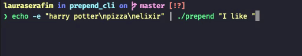
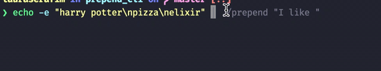

<p align="left">
   
</p>

# Prepend

> Prepends command lines arguments from stdin and writes to stdout.

[](https://github.com/LauraBeatris)
[](#)
[](https://github.com/LauraBeatris/prepend_cli/stargazers)
[](https://github.com/LauraBeatris/prepend_cli/network/members)
[](https://github.com/LauraBeatris/prepend_cli/graphs/contributors)
[](https://www.npmjs.com/package/prepend_cli)

---
<p align="center">
   
</p>

<p align="center">
   
</p>

---


# :pushpin: Table of Contents

* [Installation](#construction_worker-installation)
* [Usage](#pushpin-usage)
* [Development](#building_construction-development)
* [Found a bug? Missing a specific feature?](#bug-issues)
* [Contributing](#tada-contributing)
* [License](#closed_book-license)


# :construction_worker: Installation

Make sure you have [Elixir](https://elixir-lang.org/) installed. If you're on a Mac, just run ``brew install elixir``

Run ``mix deps.get`` and ``mix escript.build`` or combine them as ``mix do deps.get, escript.build``

- ``mix deps.get``: Download the dependencies defined inside ``mix.esx``
- ``mix escript.build``: Build the executable that can be invoked from the command line

# :pushpin: Usage

With compiled binary:

```
$ echo -e "fork\nstar" | ./prepend "Give a "
Give a fork
Give a star
```

Or run ``prepend`` directly via [mix task](https://github.com/LauraBeatris/prepend_cli/blob/master/lib/mix/tasks/prepend.ex)

```
$ echo -e "fork\nstar" | mix prepend "Give a "
Give a fork
Give a star
```

# :building_construction:	Development

- Start ``mix test.watch`` and develop TDD or run tests only once with ``mix test``
- [Property tests](https://elixir-lang.org/blog/2017/10/31/stream-data-property-based-testing-and-data-generation-for-elixir/) can be run with ``mix test --only property``
- To give the code a try in the REPL use ``iex -S mix`` and try the this:

```
["one", "two"] |> Prepend.stream_lines("$ ") |> Enum.to_list
```

- Format code using ``mix format``
- Lint code using ``mix credo`` and ``mix dialyzer``

# :bug: Issues

Feel free to **file a new issue** with a respective title and description on the the [Prepend CLI](https://github.com/LauraBeatris/prepend_cli/issues) repository. If you already found a solution to your problem, **I would love to review your pull request**! Have a look at our [contribution guidelines](https://github.com/LauraBeatris/prepend_cli/blob/master/CONTRIBUTING.md) to find out about the coding standards.

# :tada: Contributing

Check out the [contributing](https://github.com/LauraBeatris/prepend_cli/blob/master/CONTRIBUTING.md) page to see the best places to file issues, start discussions and begin contributing.

# :closed_book: License

Released in 2020

This project is under the [MIT license](https://github.com/LauraBeatris/prepend_cli/master/LICENSE).

Made with love by [Laura Beatris](https://github.com/LauraBeatris) 💜🚀
